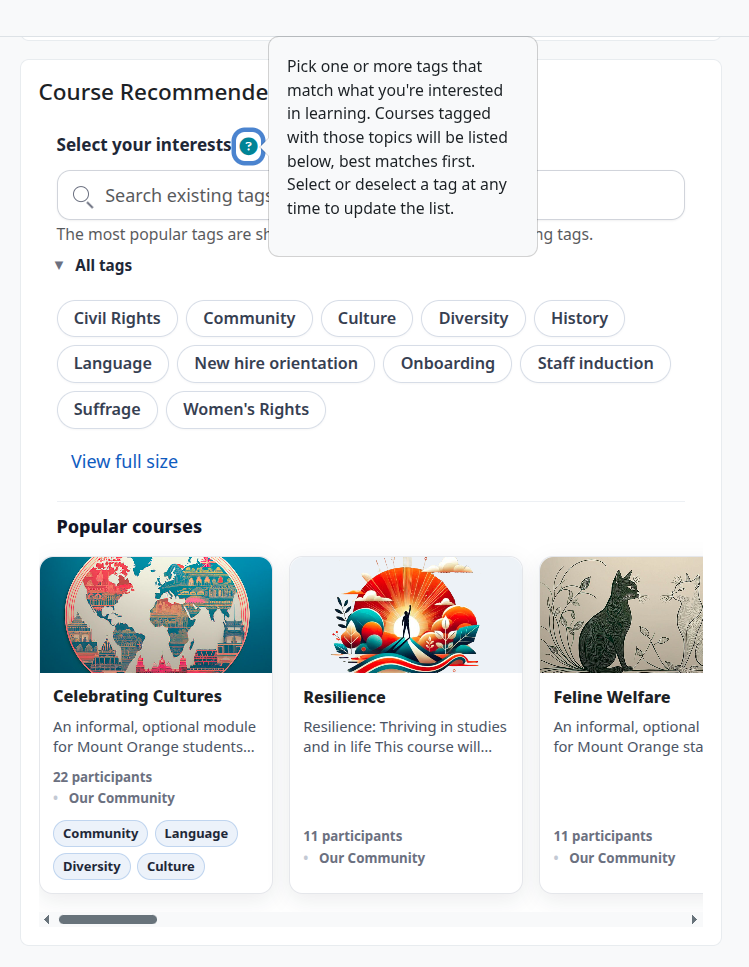
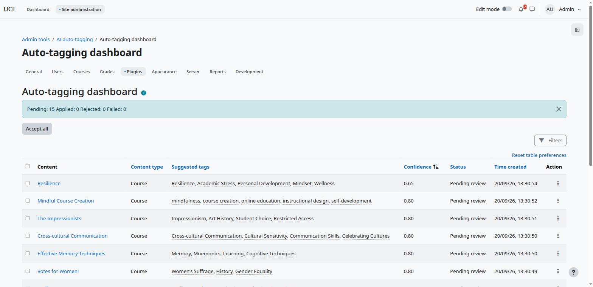
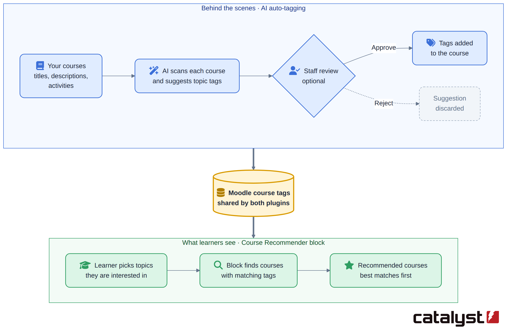

### Course Recommendation

Any reference to AI/LLM systems in this document covers external "bring your own inference" access. It is possible to use subscription cloud-based inference or in-house self-hosting. No names, emails or profile data are sent to an external LLM in any setup. When AI blurbs use Moodle’s AI subsystem, the provider may receive a hashed pseudonymous user ID.

The Course recommendation system uses two plugins, the Course recommender block and the AutoTag tool.

### The Course recommender block

A user with the required role can add this to an individual course, to every course, to a user's profile or to their /my page. It shows a set of topic labels, such as "Leadership", "Excel" or "First Aid". A learner clicks the topics they're interested in, and the block lists courses that match them. It helps people find relevant courses without searching the whole catalogue.

The topics come from the **tags** that course administrators already add to courses. The plugin doesn't need a separate list of topics. If a course is tagged "Excel", "Excel" becomes a topic in the block.

## Why different people see different topics

Everyone starts from the same list: every tag used on at least one course (up to a configurable maximum tag count). The list is then personalised for each user.

1. **Topics that lead nowhere new are removed.** Suppose every course tagged "Excel" is one the learner is already enrolled in or has finished. Showing "Excel" would only offer courses they already have, so it's hidden for them.

2. **Topics linked to their current learning come first.** Suppose a learner is taking a course tagged "Leadership", and other Leadership courses exist that they haven't taken. "Leadership" moves to the front of their list and is highlighted, because it's a likely next step.

3. **Their earlier choices are remembered.** If this feature is turned on, the topics a learner picked last time are already selected when they come back.

4. **The list can be kept short.** An administrator can limit how many topics are shown at once. The rest are still available through a search box.

Guests, and learners with no courses yet, see the full list without these personal adjustments.

### The AutoTag tool

Moodle has a mature tagging system which is used by the Course recommender block.
The AutoTag tool uses an external AI/LLM to automate applying tags to Moodle courses. It would be possible to use the block with manually applied course tags, but this tool automates the process with an additional human approval step. The tags are created by scanning

1. Course fullname
1. Course summary
1. Existing module tags

### Tag Approval

Because this plugin does not need “real time” performance it can be configured to use a low resource local LLM. AutoTag is configurable to either allocate the tags automatically or to require approval by the site admin. It offers a settings panel to control this and various other details of the process. Alternatively Catalyst could offer access to the inference to satisfy any requirements around data sovereignty etc.

### Behind the scenes

