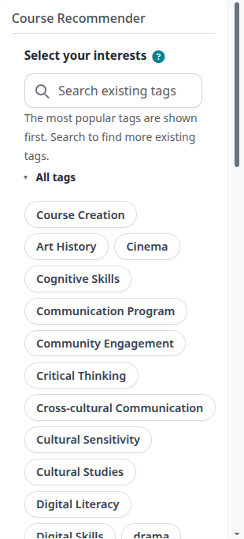
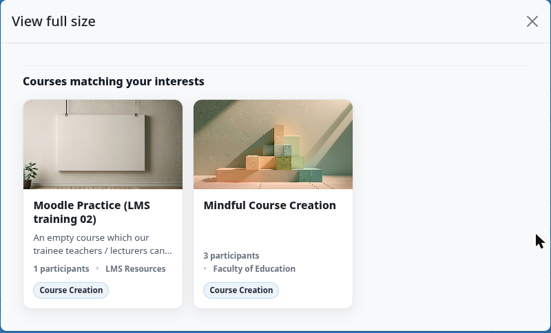

## Course Recommender Block - User Documentation

What it does

Block shows tag badges built from all course tags on site. User picks interests (tags), block AJAX-fetches matching courses and lists them below form. No selection = shows popular courses (by active enrolments).

Adding block to a page

1. Turn editing on.
2. "Add a block" -> "Course Recommender".
3. Needs block/course_recommender:addinstance (editingteacher, manager) or myaddinstance (any user, for My Home).
4. Also addable on user profile pages (uses the default applicable_formats(), no override) - the "mypublic" page layout has a side-pre block region. Adding it from a user's own profile scopes it to that one profile only. To show it on every user's profile sitewide: Site administration > Appearance > Default profile page (/user/profilesys.php), add the block, then "Reset profile for all users" (discards users' own profile customisations). See [placement.md](placement.md) for Dashboard, course and other placements.

Using it

- Tags render as clickable badges, most popular first (or A-Z/Z-A per admin setting), inside a
  collapsible "All tags" section (open by default - click the summary to collapse/expand). Badges
  wrap onto multiple lines rather than scrolling.
- A help icon (?) next to "Select your interests" explains what picking tags does.
- Click badge to toggle selected (highlighted). Selection auto-submits after 300ms debounce, no page reload.
- Search box filters visible badges by typed text (case-insensitive substring match).
- Results area updates below: course card per match - image, title, category, summary (120 chars, tags stripped), participant count, matching tags.

- A "View full size" button opens the current results in a larger modal dialog, laid out as a
  wrapped grid instead of the block column's horizontal-scroll strip - useful when the block is in
  a narrow region (sidebar, profile page) and there are several matches.

- No tags on site: block shows "No tags available for courses."
- Interests picked but none match any course: "No matching courses found."
- Guest users blocked from fetching results (noguest exception).

AI "why recommended" blurb (optional)

When enabled, each matching-course card gets an extra italic sentence under the summary
explaining why that course fits the student's picked interests, written by an LLM.

- Off by default. Only fires when interests are selected - popular-courses view (no
  selection) never shows blurbs.
- Data sent to the AI backend: course title, tags, and the same 120-char summary already
  shown on the card, plus the student's chosen interest tags. No student profile data,
  enrolment history, or other personal data is sent - see Data / privacy below.
- One AI call per results request, batched for up to 8 courses at once (not one call per
  course).
- If the AI call fails, is disabled, or returns something unparseable, the card just
  renders without a blurb - never blocks or errors out the course list.
- Uses Moodle core AI subsystem (`core_ai_subsystem`) by default; can be pointed at
  `local_ai_manager` or `tool_aimanager` instead if installed, and silently falls back to
  `core_ai_subsystem` if the chosen plugin isn't present.
- Requires an enabled AI provider configured under Site administration -> AI (e.g. OpenAI,
  Ollama) with the `generate_text` action available - otherwise blurbs silently don't
  appear.

Personalisation by enrolment/completion (optional)

- "Refine tags by your enrolments" and "Refine using completed courses" are separate
  settings, both off by default, both usable together.
- When either is on: tags that would only lead to courses the student is already
  enrolled in / has completed are hidden from the interest list, and tags shared with
  those courses are moved to the top and highlighted instead.
- "Refine using completed courses" additionally excludes already-completed courses from
  both the popular-courses view and the matching-courses results, so a completed course
  never gets re-recommended.
- Only considers courses with completion tracking enabled (`enablecompletion = 1`).
  Completion data is read live from core (`{course_completions}`) on every block load -
  nothing is cached or stored by this plugin.

Personalisation by competency (optional)

- "Refine using competencies" (off by default) feeds the student's proficient
  competencies (from `core_competency`, across all of the student's learning plans) into
  similarity-based re-ranking as a further signal, alongside interests and completed
  courses.
- Only competencies marked proficient in a plan count - competencies merely added to a
  plan but not yet achieved are ignored.
- Requires "Enable similarity-based re-ranking" to also be on; requires the Competencies
  subsystem (`core_competency`) to be present. Competency data is read live on every
  block load - nothing is cached or stored by this plugin.

Similarity-based re-ranking (optional)

- "Enable similarity-based re-ranking" (off by default) re-orders matching courses by
  semantic similarity instead of exact tag-count only, using an embedding backend
  (OpenAI, an OpenAI-compatible endpoint, or Ollama - configured separately).
- With only interests selected, courses are ranked against an embedding of the
  student's chosen interest tags.
- If "Refine using completed courses" and/or "Refine using competencies" are also on,
  the student's completed-course titles/tags/summaries and/or proficient-competency
  names/descriptions are embedded and blended in as secondary signals - so, for example,
  a course tagged "machine-learning" can outrank one tagged "excel" for a student who
  previously completed a data-related course or holds a related competency, even without
  an exact tag match on either.
  - Interests + completed courses only: weighted 70% interest / 30% completion.
  - Any combination that also includes competencies: weighted 60% interest / 25%
    completion / 15% competency (weights renormalised across whichever of the three
    signals are actually present, e.g. interests + competencies only still sum to 100%).
- Course-level vectors are cached in the `course_recommender_vector` table (keyed by
  course + embedding model); the student's completed-course text and competency text are
  embedded fresh on each request and not cached.
- Any failure (backend misconfigured, API error, disabled setting) is swallowed and the
  course list falls back to its normal tag-count order - re-ranking is an enhancement,
  never a dependency.

Admin settings (Site administration -> Plugins -> Blocks -> Course Recommender)

- Tag Color: badge highlight color (color picker). Default #0073e6.
- Maximum number of tags: caps badges shown initially; 0 = no limit. Search still limited to 20 matches (or maxtags value) at once. Default 0.
- Tag Sorting: popularity (course-count desc), az, or za. Default popularity.
- Refine tags by your enrolments: on/off. Default off.
- Refine using completed courses: on/off. Default off.
- Refine using competencies: on/off. Default off. Requires core_competency.
- Remember selected interests: on/off. Default off. Persists the student's last-picked
  interest tags between visits (see Data / privacy below).
- Enable similarity-based re-ranking: on/off. Default off. Requires an embedding backend
  configured below.
- Enable AI "why recommended" blurb: on/off. Default off.
- AI blurb backend: core_ai_subsystem / local_ai_manager / tool_aimanager. Default core_ai_subsystem.
- AI blurb purpose: purpose string passed to local_ai_manager for routing/quota; ignored by other backends. Default "feedback".

Tag list cached app-wide (block_course_recommender/tags cache) - cache purge needed to see brand-new tags immediately (or falls off on next cache miss).

Data / privacy

By default the plugin stores no personal data - it only reads existing core tag,
tag_instance, course, enrol, user_enrolments, course_completions and competency
(core_competency) tables live, on every request.

The one exception: if "Remember selected interests" is turned on, the student's
selected interest tags are persisted per-user (`course_recommender_interest` table,
scoped to the student's own user context). classes/privacy/provider.php implements
full export/delete support for this table via the standard GDPR request flow; turning
the setting back off does not retroactively delete already-stored rows. Completion,
enrolment and competency data used for tag refinement/exclusion/re-ranking is never
itself stored by this plugin - only read at request time.

With the AI blurb and/or similarity re-ranking enabled, course title/tags/summary, the
student's selected interest tags, and (if "Refine using completed courses" and/or
"Refine using competencies" are also on) the student's completed-course
titles/tags/summaries and/or proficient-competency names/descriptions are sent to
whichever AI/embedding backend is configured (may be an external API such as OpenAI, or
self-hosted e.g. Ollama). This is public course data / the student's own achieved
competencies, not a raw profile field, but it is correlated to one student's history in
a single request - if the configured provider is external, review its own
data-handling terms before enabling any of these features.

Future work / considered options

- Block column width is narrow by nature of the block region, capping course-card width
  (17rem or 78% of column, whichever smaller). Considered option: add a sibling
  local_course_recommender plugin exposing the same recommendations on a full-width page
  (own nav/dashboard entry), reusing the existing classes/ logic (embedder.php,
  reranker.php, interest_store.php, llm_bridge.php, blurb_generator.php, vector_store.php,
  embedding/ - none of these are block-specific). The block would stay as a compact entry
  point / teaser, optionally linking to the full-page view. Not built - flagged here so the
  option isn't lost if wider layout becomes a real requirement.

Permissions

- block/course_recommender:view - block context - user: allow, guest: prevent.
- block/course_recommender:addinstance - block context - editingteacher, manager.
- block/course_recommender:myaddinstance - system context - user.

Version

- Component: block_course_recommender
- Release 1.10.0 (build 2026092001)
- Requires Moodle 2022041900+ (4.0+); AI blurb feature requires Moodle 4.5+ for the core AI subsystem
